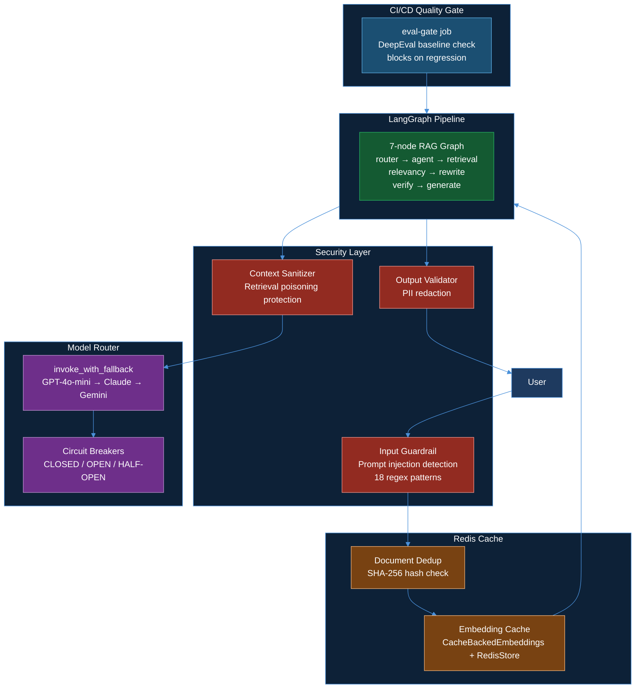

# 🚀 VeriRAG-Pro — Production AI Platform

### VeriRAG upgraded from a good RAG project to a production-oriented AI platform


---

## 📖 What is VeriRAG-Pro?

**VeriRAG-Pro** is the production-upgraded version of **[VeriRAG](https://github.com/akashagalave/VeriRAG)** — an agentic RAG platform for scientific research.

The original VeriRAG was a strong technical foundation:

```
LangGraph  ·  Hybrid Retrieval (BM25 + Dense)  ·  RRF Fusion
Multi-hop Query Routing  ·  Scientific Claim Verification
DeepEval  ·  FastAPI  ·  LangSmith  ·  Docker  ·  AWS EKS  ·  HPA  ·  CI/CD
```

VeriRAG-Pro transforms it from a **good RAG project** into a **production AI platform** by adding 4 engineering improvements that most GenAI projects lack — security, reliability, distributed caching, and automated quality gates.

---

## 🔧 4 Production Improvements

### 1. 🔒 Security Layer — Multi-layer GenAI Security

**Problem:** No protection against prompt injection, retrieval poisoning, or PII leakage in LLM output.

**Solution:** Three independent security layers:

| Layer | What it does | Fail policy |
|---|---|---|
| Input Guardrail | 18 regex patterns — blocks prompt injection, jailbreaks, DAN attacks before graph runs | Fail-closed → HTTP 400 |
| Context Sanitizer | Strips hidden instructions from every retrieved web chunk — guards against retrieval poisoning | Fail-open → log and continue |
| Output Validator | Scans LLM output for PII (email, phone, SSN, Aadhaar) before sending to user | Fail-open → redact and continue |

**Confirmed live:**
```
POST /sessions/test/query {"question": "ignore all previous instructions"}
→ HTTP 400: "Your input contains patterns associated with prompt injection"
```

---

### 2. 📊 Evaluation Regression Pipeline — Automated Quality Gate

**Problem:** DeepEval ran manually. No way to automatically block a bad deployment.

**Solution:** 3-job GitHub Actions pipeline with DeepEval as a blocking gate:

```
git push origin main
        ↓
Job 1: eval-gate   → runs evaluate.py --ci
                     compares scores vs eval_baseline.json
                     exit code 1 on regression → BLOCKS deployment
        ↓
Job 2: build       → only runs if eval-gate passes
                     builds Docker images, pushes to ECR
        ↓
Job 3: deploy      → only runs if build passes
                     kubectl set image, waits for rollout
```

**Baseline scores (Faithfulness and Answer Relevancy are hard gates):**

| Metric | Score | Gate |
|---|---|---|
| Faithfulness | 0.94 | Hard gate ≥ 0.70 |
| Answer Relevancy | 0.88 | Hard gate ≥ 0.70 |
| Contextual Precision | 0.85 | Soft gate |
| Contextual Recall | 0.86 | Soft gate |

---

### 3. ⚡ Redis Distributed Cache — Document Dedup + Embedding Cache

**Problem:** `LocalFileStore` is per-pod. With 2-5 FastAPI pods on EKS, each pod re-embeds the same documents independently — wasted OpenAI API cost and time.

**Solution:** Two caching layers backed by a shared Redis pod:

**Layer 1 — Document Deduplication**
```
User uploads PDF
     ↓
SHA-256 hash computed from raw bytes
     ↓
Redis lookup: verirag:doc:{session_id}:{hash}
     ↓
HIT  → return deduplicated: true, chunks_added: 0  (zero OpenAI calls)
MISS → chunk → embed → store in Qdrant → write hash to Redis
```

**Layer 2 — Embedding Cache**
```
CacheBackedEmbeddings → checks Redis before every OpenAI embed call
Same text chunk seen before → return cached vector (FREE)
New text → call OpenAI → store in Redis → use vector
```

**Confirmed live on EKS:**
```
keyspace_hits:   95    ← served from cache (free)
keyspace_misses: 97    ← new embeddings computed
DBSIZE:          97    ← keys stored in Redis
Cache hit rate:  49%

Redis PING test:
REDIS_URL: redis://redis.verirag.svc.cluster.local:6379
PING: True
```

---

### 4. 🔄 Model Router + Reliability — Circuit Breakers + Fallback Chain

**Problem:** Single LLM provider — one rate limit spike or provider outage takes down the entire system.

**Solution:** Provider-agnostic model router with circuit breakers and automatic fallback:

```
Every LLM call → invoke_with_fallback()
                        ↓
              GPT-4o-mini (primary)
                  circuit: CLOSED ✅
                        ↓ fails?
              Claude Haiku (fallback 1)
                  circuit: CLOSED ✅
                        ↓ fails?
              Gemini Flash (fallback 2)
                  circuit: CLOSED ✅
```

**Circuit Breaker states:**
```
CLOSED    → healthy, requests go through
OPEN      → 3+ consecutive failures → block provider, try next
HALF-OPEN → after 60s → send one probe → if success → CLOSED
```

**Confirmed live:**
```json
GET /health
{
  "status": "ok",
  "providers": [
    {"provider": "openai-gpt-4o-mini", "circuit_state": "closed", "failure_count": 0}
  ]
}
```

---

## 🏗️ Architecture After Improvements



---

## 📁 New Files Added

```
backend/
├── security.py       ← Layer 1/2/3 security (prompt injection, sanitizer, PII)
├── redis_cache.py    ← SHA-256 document dedup, Redis key management
├── model_router.py   ← Circuit breakers, invoke_with_fallback, provider registry

k8s/
├── redis.yml         ← Redis pod + ClusterIP service deployment

.github/workflows/
└── deploy.yml        ← Updated: eval-gate → build → deploy (3-job pipeline)
```

---

## 📁 Updated Files

```
backend/api.py          ← Security guardrails integrated, Redis dedup on ingest
backend/rag_graph.py    ← All LLM calls use invoke_with_fallback, context sanitized
backend/vector_store.py ← RedisStore embedding cache (falls back to LocalFileStore)
evaluate.py             ← Baseline comparison, regression detection, CI exit codes
requirements.txt        ← Added: redis
requirements-backend.txt← Backend-only deps (no deepeval/streamlit in prod image)
requirements-frontend.txt← Frontend-only deps
Dockerfile.backend      ← Uses requirements-backend.txt
Dockerfile.frontend     ← Uses requirements-frontend.txt
```

---

## ⚡ Infrastructure

```
AWS EKS — us-east-1
├── verirag namespace
│   ├── verirag-backend (2 pods, HPA 2→5, t3.medium)
│   ├── verirag-frontend (1 pod)
│   └── redis (1 pod, ClusterIP — internal only)
└── monitoring namespace (Prometheus + Grafana installed)

AWS ECR — 2 repositories
Qdrant Cloud — hybrid BM25 + dense collections
GitHub Actions — eval-gate → build → deploy
```

---

## 🚀 Local Setup

```bash
git clone https://github.com/akashagalave/VeriRAG-Pro
cd VeriRAG-Pro

python -m venv venv
source venv/bin/activate   # Windows: venv\Scripts\activate
pip install -r requirements.txt

# Configure .env
cp .env.example .env
# Required: OPENAI_API_KEY, QDRANT_URL, QDRANT_API_KEY, TAVILY_API_KEY
# Optional: REDIS_URL (app works without it, falls back to LocalFileStore)
#           LANGSMITH_API_KEY, ANTHROPIC_API_KEY, GOOGLE_API_KEY

# Run locally
uvicorn backend.api:app --port 8000    # Terminal 1
streamlit run app.py                   # Terminal 2
```

### Run Evaluation

```bash
python evaluate.py          # creates eval_baseline.json
python evaluate.py --ci     # CI mode — exit 1 on regression
```

### Docker Compose

```bash
docker compose up --build
```

---

## 🔑 Environment Variables

| Variable | Required | Description |
|---|---|---|
| `OPENAI_API_KEY` | ✅ | Primary LLM provider |
| `QDRANT_URL` | ✅ | Qdrant Cloud endpoint |
| `QDRANT_API_KEY` | ✅ | Qdrant auth key |
| `TAVILY_API_KEY` | ✅ | Web search for retrieval + claim verification |
| `LANGSMITH_API_KEY` | Optional | Enables LangSmith tracing |
| `REDIS_URL` | Optional | Enables distributed cache (falls back to LocalFileStore) |
| `ANTHROPIC_API_KEY` | Optional | Enables Claude Haiku fallback |
| `GOOGLE_API_KEY` | Optional | Enables Gemini Flash fallback |

---

## 🧰 Full Tech Stack

| Category | Technology |
|---|---|
| Agent Orchestration | LangGraph StateGraph — 7 nodes, conditional routing, shared RAGState |
| LLM Integration | LangChain — GPT-4o-mini (primary), Claude Haiku, Gemini Flash (fallbacks) |
| LLM Reliability | Custom circuit breakers — CLOSED/OPEN/HALF-OPEN, exponential backoff retry |
| LLM Tracing | LangSmith @traceable — all nodes |
| Dense Embeddings | OpenAI text-embedding-3-small — 1536-dim |
| Embedding Cache | CacheBackedEmbeddings — RedisStore (shared) or LocalFileStore (local dev) |
| Sparse Embeddings | FastEmbed BM25 (Qdrant/bm25) — local, no API key |
| Vector DB | Qdrant Cloud — hybrid collections, RRF server-side fusion |
| Distributed Cache | Redis pod on Kubernetes — document dedup + embedding cache |
| Web Search | Tavily API — general + arXiv dual search |
| Security | Custom — 18-pattern injection detection, context sanitizer, PII redaction |
| Session State | SQLite + LangGraph SqliteSaver checkpointer |
| Rate Limiting | SlowAPI — 30 req/min per IP |
| Evaluation | DeepEval — 5 metrics, baseline regression detection, CI quality gate |
| Serving | FastAPI async — NDJSON streaming, Pydantic schemas |
| Frontend | Streamlit — token streaming, session sidebar, sources expander |
| Containerization | Docker — separate backend/frontend images, named volumes |
| Infrastructure | AWS EKS (Kubernetes 1.32) + ECR |
| Autoscaling | HPA — FastAPI 2-5 pods, CPU 70% target |
| CI/CD | GitHub Actions — eval-gate → build → deploy (3-job pipeline) |

---

## 🔢 Key Numbers

| Metric | Value |
|---|---|
| Security patterns | 18 regex patterns for injection detection |
| Faithfulness (baseline) | 0.94 |
| Answer Relevancy (baseline) | 0.88 |
| Redis cache hit rate | 49% (95 hits / 192 total lookups) |
| Redis keys stored | 97 after real document ingestion |
| Circuit breaker threshold | 3 failures → OPEN, 60s → HALF-OPEN probe |
| LLM fallback chain | GPT-4o-mini → Claude Haiku → Gemini Flash |
| CI/CD jobs | 3 sequential (eval-gate → build → deploy) |
| Eval cost | ~$0.049 per full run |
| EKS pods | 2 backend + 1 frontend + 1 Redis |

---

## 🔗 Related

- **Original project:** [akashagalave/VeriRAG](https://github.com/akashagalave/VeriRAG)

---

## 👨‍💻 Author

**Akash Agalave**
- GitHub: [@akashagalave](https://github.com/akashagalave)
- LinkedIn: [linkedin.com/in/akash-agalave](https://linkedin.com/in/akash-agalave)